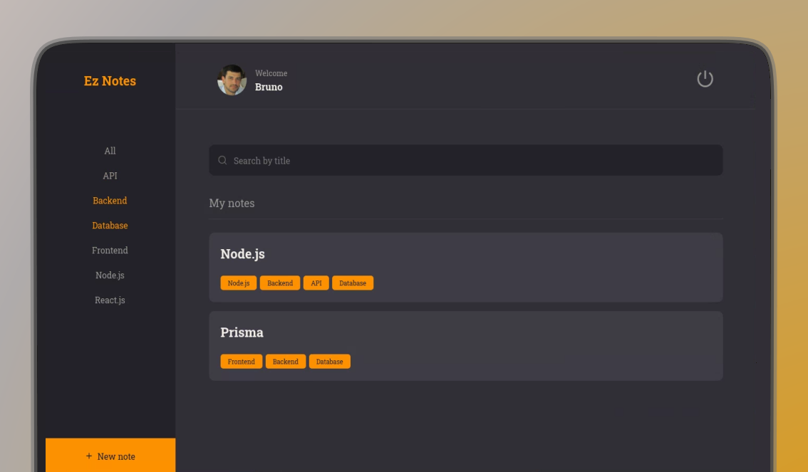

<h1 align="center">EZ Notes</h1>

<br />
<p align="center"> 
   
	 
  	<a href="https://github.com/brunosduarte/eznotes/commits/master"> 
   		 
 	</a> 
  	<a href="https://opensource.org/licenses/MIT"> 
   		 
  	</a> 
</p>

## 🗂 Contents

- 📋 [Project](#-project)
  - 🚀 [Technologies](#-technologies)
  - 📷 [Preview](#-preview)
- 📦 [Instalation](#-instalation)
- ⚖️ [License](#%EF%B8%8F-license)
- 📫 [Contact](#-contact)

## 📋 Project

A web application where users can register and create organized notes on specific subjects. It allows adding the titles descriptions, links, and tags for each note and also includes user profile editing.

### 🚀 Technologies

[](https://vitejs.org)
[](https://nodejs.org)
[](https://www.jest.com)
[](https://pm2.io)
[](https://knexjs.org)
[](https://www.sqlite.org)
[](https:/npmjs.com/package/multer)
[](jwt.io)
[](https://axios-http.com)

## 📷 Preview

##### 💻 frontend:

<p align="center"> 
  
</p>

## 📦 Instalation

To clone and run this application, you will need [Git][git], [NodeJS v18.17.1][nodejs] or higher + [npm v9.17.1][npm] or higher, and [PNPm 8.7.5][pnpm] installed on your computer. In your terminal, run:

```bash
# Cloning repo
$ git clone https://github.com/brunosduarte/eznotes.git eznotes
```

```bash
# Backend

# Go to the repository
$ cd server

# Install the dependencies
$ npm i

# Run the API
$ npm run dev

# Note: After running the command above, the API will be available at http://localhost:3333

```

```bash
# Frontend

# Got to the repository
$ cd web

# Install dependencies
$ npm i

# Execute
$ npm run dev
```

## ⚖️ License

This project is under license. [MIT](LICENSE).

## 📫 Contact

by [**Bruno Duarte**](https://www.linkedin.com/in/brunosduarte/) 🚀

[git]: https://git.scm.com
[nodejs]: https://nodejs.org/
[npm]: https://www.npmjs.com/
[PNPm]: https://pnpm.io/pt/
